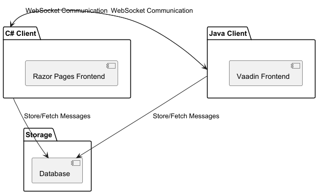

# Welcome to the ChatRoom Application
This project consists of two chat-client microservices, each written in a different programming language, and a 
centralized database for message storage and retrieval. The goal is to allow the two clients to communicate with each 
other in real-time while sharing a common storage for persistence.

### Idea's for future
- [ ] Service bus for scalability
- [ ] Keycloak server for centralized authentication
- [ ] Standalone Frontend for consistency (e.g. Vue/ Angular/ React)

### Learning Goals
- Microservices
- Cross technology communication
- Security
  - Encryption
  - Authentication
- WebSocket

### High Level Design

### Technologies Used
- **C# Client**
  - .NET 6
  - C#
  - Blazor
  - SignalR

- **Java Client**
  - Java 21
  - SpringBoot
  - Vaadin
  - [kafka?]

- **Data Storage**
  - [PostgreSql/ MySql/ SQL Server?]

    
    

